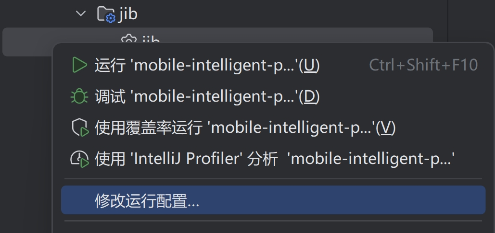
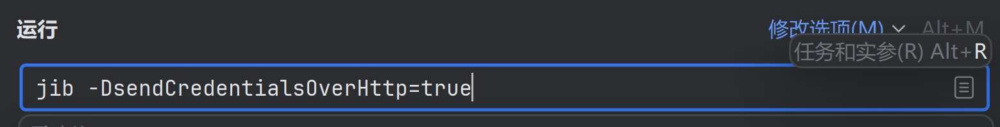
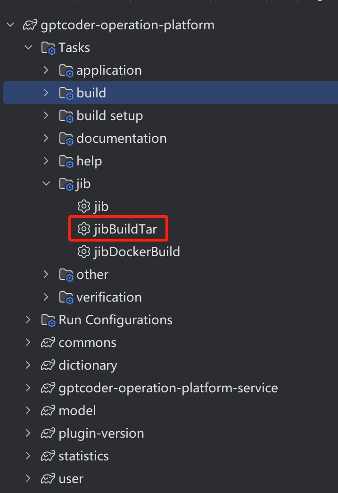

# 1、修改jib配置

打开idea中右边的gradle插件，然后展开对应服务的任务中的jib任务，右键修改运行配置，增加-DsendCredentialsOverHttp=true





# 2、打包镜像

执行对应服务的jib任务，会生成镜像并推送到镜像仓库



# 3、修改配置文件
```shell
#修改数据库配置文件 gptcoder-operation-platform-service/src/main/resources/application.yaml
datasource.url
datasource.username
datasource.password
#修改apisix和authen服务ip和端口
coder.config.url.apisix
coder.config.url.authentication

#修改gptcode-authentication-service数据库配置文件gptcode-authentication-service/src/main/resources/application.yaml
spring.data.redis.host
spring.data.redis.port
```


# 4、部署

```shell
#进入需要部署的目录
cd /disk/gptcoder
# 停止旧服务并删除镜像
docker-compose -f docker-compose-operation-platform-prod.yml down --rmi all
# 备份数据、执行数据变更的ＳＱＬ
# 更改镜像版本号，如果需要
vim docker-compose-operation-platform-prod.yml
# 更改配置文件，如果有需要
vim config/platform/application-prod.yml
#load镜像
docker load -i gptcoder-authentication-service-1.1.1-image.tar
docker load -i gptcoder-operation-platform-service-open_source_1.0-image.tar
# 启动服务
docker-compose -f docker-compose-operation-platform-prod.yml up -d
```

